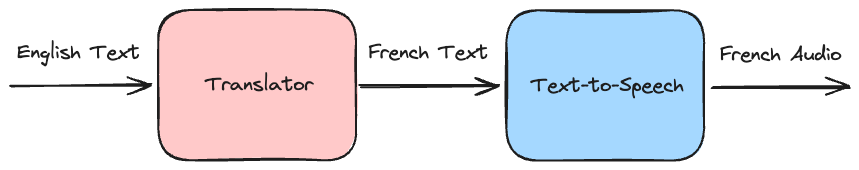

# Translation with Text-to-Speech with Hugging Face Transformers and Gradio

**Code repository for the blog post:** [Navigating Hugging Face Transformers: Your Guide to Open Source 🤗 Models, Datasets, Spaces, and More](https://neuralnarratives.jawadur.com/p/navigating-hugging-face-transformers)



## Setup

Install the required dependencies:

```shell
pip install -r requirements.txt
```

## Run the Application

```shell
python app.py
```